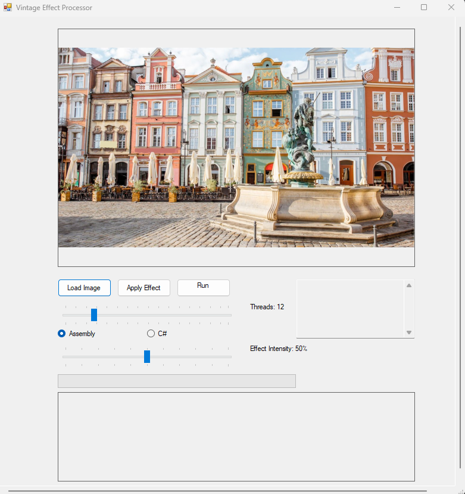
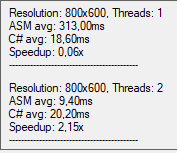

# Vintage Effect Processor - Assembly vs C# Performance Comparison


A comprehensive performance comparison between Assembly x64 and C# implementations of a vintage sepia effect processor. Features multithreading optimization, advanced benchmarking, and real-time image processing with customizable parameters.

## About The Project

This project demonstrates low-level optimization techniques by implementing the same sepia effect algorithm in both Assembly x64 and C#. The application provides:

- **Real-time Image Processing** with vintage sepia effects
- **Performance Benchmarking** comparing Assembly vs C# implementations
- **Multithreading Support** with configurable thread counts (1-64)
- **Interactive UI** with live effect intensity adjustment
- **Detailed Performance Metrics** including speedup analysis

## Screenshots

### Main Application Interface


### Benchmark Results


### Before and After Effect


## Technical Implementation

### Assembly x64 Features
- **AVX Instructions** - Advanced Vector Extensions for SIMD operations
- **Custom DLL** - Native code integration with managed C#
- **Memory Optimization** - Direct memory manipulation for performance
- **Threading Support** - Parallel processing across multiple cores

### C# Implementation
- **Unsafe Code** - Direct memory access for performance comparison
- **Task Parallel Library** - Managed multithreading
- **Bitmap Processing** - Native .NET image manipulation
- **Linear Congruential Generator** - Custom noise generation

## Algorithm Details

### Sepia Effect Formula
```
Red   = (R × 0.393) + (G × 0.769) + (B × 0.189)
Green = (R × 0.349) + (G × 0.686) + (B × 0.168)  
Blue  = (R × 0.272) + (G × 0.534) + (B × 0.131)
```

### Noise Generation
- **Linear Congruential Generator** for vintage grain effect
- **Thread-safe** seeding for parallel processing
- **Intensity-based** scaling for customizable effect strength

## Performance Results

### Typical Benchmark Results
```
Resolution: 1920x1080, Threads: 8
ASM avg: 45.2ms
C# avg: 187.6ms
Speedup: 4.15x
```

### Thread Scaling Performance
- **Single Thread**: 2-3x speedup (Assembly vs C#)
- **Multi Thread**: 4-8x speedup depending on core count
- **Optimal Thread Count**: Usually matches CPU core count

## Building and Running

### Prerequisites
- **Visual Studio 2019+** with C++ build tools
- **MASM (ml64.exe)** for Assembly compilation
- **.NET Framework 4.7.2+**
- **Windows 10/11** (x64 architecture)

## Usage

1. **Load Image** - Click "Load Image" and select a photo
2. **Adjust Settings**:
   - **Thread Count**: 1-64 threads for parallel processing
   - **Effect Intensity**: 0-100% sepia strength
   - **Implementation**: Choose Assembly or C# version
3. **Apply Effect** - Process single image with current settings
4. **Run Benchmark** - Compare performance across different configurations

## Learning Outcomes and Technical Insights

### Assembly Programming Concepts
- **x64 Calling Conventions** - Parameter passing and register usage
- **SIMD Instruction Usage** - AVX instructions for vector operations
- **Memory Management** - Direct memory manipulation and alignment
- **DLL Interop** - Creating and consuming native libraries

### Performance Engineering
- **Benchmarking Methodology** - Statistical analysis with multiple runs
- **Threading Optimization** - Scaling across multiple cores
- **Memory Access Patterns** - Cache-friendly algorithms
- **Vectorization Challenges** - Understanding SIMD limitations

### Implementation Notes

**Current Vectorization Approach:**
The Assembly implementation uses AVX instructions but processes pixels individually rather than in true SIMD fashion. This was a learning exercise in SIMD programming concepts.

**Potential Improvements:**
- True vectorization (4 pixels simultaneously)
- Cache-line optimization
- Prefetching strategies
- Advanced SIMD techniques

## Project Structure

### Core Components
- **MainForm.cs** - User interface and application logic
- **JAAsm.asm** - Assembly implementation with AVX instructions
- **VintageEffectCS.cs** - C# reference implementation
- **BenchmarkResult.cs** - Performance measurement framework

### Key Features
- **Cross-language Integration** - Seamless Assembly/C# interop
- **Statistical Benchmarking** - Multiple runs with standard deviation
- **Memory Safety** - Proper resource management and cleanup
- **Error Handling** - Robust exception handling throughout

## What I Learned

### Low-Level Programming
- **Assembly Language** - x64 instruction set and optimization
- **System Architecture** - Understanding CPU capabilities and limitations
- **Memory Management** - Direct manipulation and performance implications
- **SIMD Programming** - Vector instruction usage and challenges

### Software Engineering
- **Performance Measurement** - Scientific benchmarking approaches
- **Cross-Platform Interop** - Native/managed code integration
- **UI Development** - Windows Forms for technical applications
- **Project Organization** - Complex multi-language project structure

### Computer Science Concepts
- **Parallel Processing** - Thread management and synchronization
- **Algorithm Optimization** - Comparing different implementation approaches
- **Image Processing** - Pixel manipulation and color space transformations
- **Statistical Analysis** - Performance data interpretation

## Future Enhancements

- **True SIMD Implementation** - Process 4+ pixels simultaneously
- **GPU Acceleration** - CUDA or OpenCL implementations
- **Additional Effects** - More vintage filters and processing options
- **Batch Processing** - Handle multiple images efficiently
- **Advanced Optimization** - Cache optimization and prefetching

## Author

**Jakub Hapek** - Computer Science Student

Project was created on Assembly Languages classes at university.
